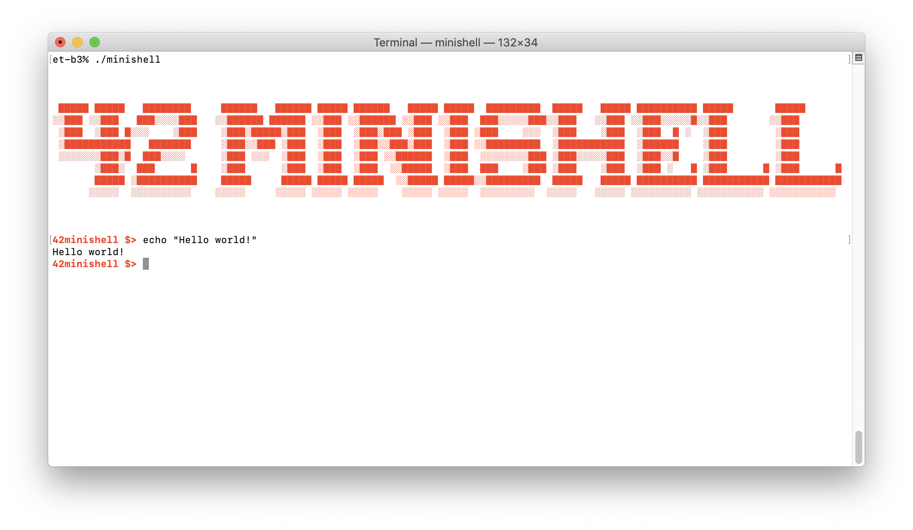

## Minishell - as beautiful as a shell

### About

This project is all about creating a simplified shell program that can run binaries, have a working history, built-in functionality like echo or export, and more.

Shell capabilities:
* Have a working History with saving after reboot.
* Search and launch the right executable (based on the PATH variable or by using
relative or absolute path)
* It must implement the builtins:
  * echo with option -n
  * cd with only a relative or absolute path
  * pwd with no options
  * export with no options
  * unset with no options
  * env with no options or arguments
  * exit with no options
* ' inhibit all interpretation of a sequence of characters.
* " inhibit all interpretation of a sequence of characters except for $.
* Redirections:
  * "<" should redirect input.
  * ">" should redirect output.
  * "<<" read input from the current source until a line containing only the delimiter is seen. it doesn’t need to update history!
  * ">>" should redirect output with append mode.
* Pipes | the output of each command in the pipeline is connected via a pipe to the
input of the next command.
* Environment variables ($ followed by characters) should expand to their values.
* $? should expand to the exit status of the most recently executed foreground
pipeline.
* ctrl-C ctrl-D ctrl-\ works like in bash.
* When interactive:
  * ctrl-C print a new prompt on a newline.
  * ctrl-D exit the shell.
  * ctrl-\ do nothing.

All functions are created in accordance with [Norm](https://github.com/42School/norminette) - the bunch of rules how code should be formatted.

### Project rules

* Not interpret unclosed quotes or unspecified special characters like \ or ;.
* Show a prompt when waiting for a new command.

### Requirements & usage
Project requires:
* Readline library
* C Lang compiler: **gcc** or **clang**
* Possibility to work with Makefile

Tested on:
* MacOS 10.15
* Linux Ubuntu 20.04

Run:
```
$> make install && make
$> ./minishell
42minishell $> echo "Hello world!"
Hello world!
```



### Makefile commands

* make / make all / make minishell - compile project
* make srcs/*.o - compile specific source file
* make clean - clean all object files
* make fclean - clean all object files & library
* make norminette - check that all functions are created in accordance with Norm (you need to have norminette)
* make install - install readline library (you need to have Homebrew)